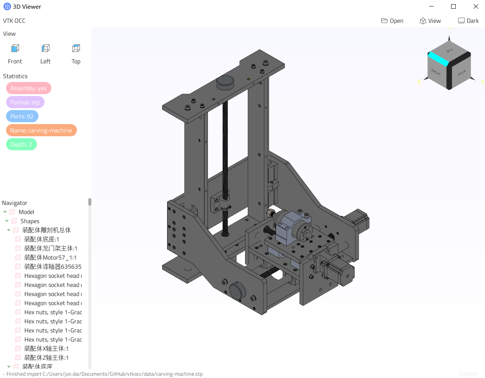

# vtkocc

A opensource and custom CAD product, based on opencadcade and vtk. 

At current stage, most of the functions refactored by typescript!

Support hot reload, you can modify ui or operate 3d viewer in app runtime(modify qsviewer-companion/main.ts, or modify main.js update ui immediately).

## Preview



## Build

Clion open the project, directly! Click 'Build' and 'Run'.

Or:

```shell
# Now, only support windows, linux will soon
# Make sure Visual Studio 2022 Community, OpenCASCADE, Qt5.12.0 in your computer!
env.bat
# Compile and run occ demo based on QScripts, latest version
build_qsviewer.bat
# Compile and run occ demo based on QJsonViewer, an early way of generating ui 
build_occviewer.bat
```

## Modules

- ui library: more Qt widgets, suck as QLinearSpinner, QNavigator(tree-like) ...
- basic functions library: read/write file, string/filepath processing ...
- high performance occ library: model file reader, multi-thread rendering ...
- ui generator library
- demo

## Construct GUI by Qt && UI generator ways

Until 09.07.2023, I came up with 5 ways of building ui in Qt:

| No | Techs Stack                         | Advantages                                                                                                 | Disadvantages                                                         |
|----|-------------------------------------|------------------------------------------------------------------------------------------------------------|-----------------------------------------------------------------------|
| 1  | QtDesigner                          | easy                                                                                                       | ugly ui                                                               |
| 2  | QWebEngineView + Pure Web Techs     | front-end Friendly, support Vue/React                                                                      | many bugs exists in event processing, lower performance then electron |
| 3  | QJsonViewer (based on QtWidgets)    | an early idea about ui auto-generating by specifying a json                                                | waste of time in compiling                                            |
| 4  | QML + QtWidgets (mixed development) | dynamic QML + origin Qt coding plugins, make ui building quick                                             | QML is in independent environment                                     |
| 5  | QScripts + Qt Origin + Typescripts  | replace most functions of c++ by typescript/javascript, support hot reload, dynamic programming in runtime | without compiling (less time costing, very important)                 |

### Supported Plugins in JSON

- QLabel
- QColorLabel: colorful label
- QFrame: useless, just for testing
- QPushButton: icon and text are defined in (.qss) file
- QToolButton: make text under icon
- QLineEdit
- QVBoxLayout: same functions like QVBoxLayout, but not it!
- QHBoxLayout
- QLinearSpinner: a kind of loader
- QNavigator: tree-like view
- QOccViewer: 3D

More getWidget plugin expected!

## Themes support

- basic: light style
- dark: dark style, incompletely

